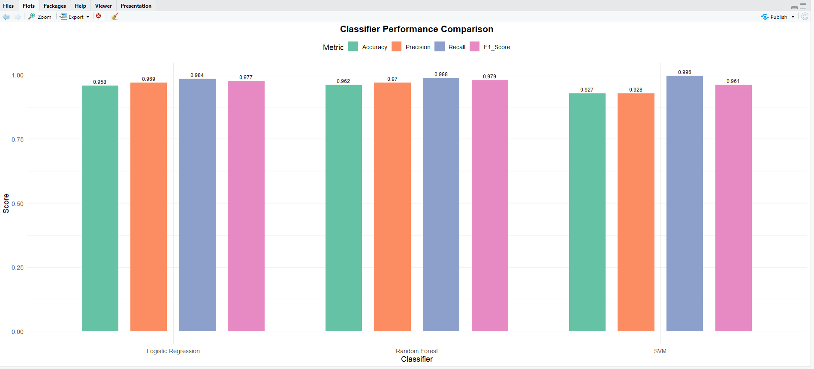

# NIT3202 – Mini Project: Twitter Spam Classifier

This project is a small machine learning classification task completed as part of the NIT3202 Data Analytics for Cyber Security unit at Victoria University Sydney.  
The goal of the project is to classify tweets as **spam** or **not spam** using multiple machine learning models in R.

---

## 🧠 Overview

The project involves:
- Loading and cleaning a real-world text dataset  
- Converting text into numeric features  
- Training and evaluating multiple classification models  
- Comparing performance using accuracy and confusion matrices  
- Summarising the results clearly for portfolio/demo purposes  

This mini-project demonstrates fundamental skills in **data cleaning**, **model training**, and **performance evaluation**, using R and the `caret` package.

---

## 🛠️ Technologies Used

- **R**  
- **caret** (model training + evaluation)  
- **randomForest** (random forest model)  
- **e1071** (SVM model)  
- **ggplot2** (optional visualisation)  
- **RStudio**  

---

